# Milestone Project 1 - ALENTEJANO-WINES

## Description
---

ALENTEJANO WINES is my first milestone project of the Full Stack Web Developer course provided by Code Institute. The aim is to create a responsive website by using the HTML and CSS languages. 

The ALENTEJANO WINES website project aims to promote wines from the vibrant region of Portugal (Alentejo) associated with local gastronomy, values and culture.

[View the live project here.](https://andrefarinha86.github.io/Alentejano-Wines/)

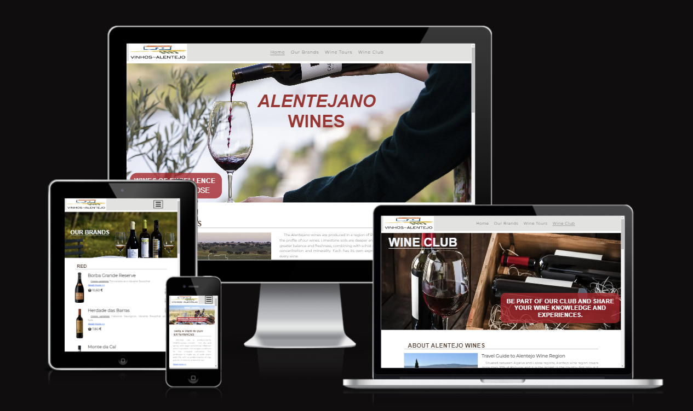

---

## User Experience (UX)

### Goals

The idea and objective of the 'Vinhos do Alentejo' project is to provide the user with an easy and understandable way of navigating and exploring the website throughout its contents.

The site was planned and designed in four distinct sections:

- Home page: The user will have the oportunyti to explore and learn more about the typical Alentejo estates and how the grapes are planted and produced.
- Our brands page: Here the user will be presented with a selective range of Alentejo wines with a detailed description of each wine.
- Wine tours page: In this section the user will be able to consult a selection of tours related with Alentejo wine world and their discription with the opossibility of booking the a desired tour.
- Wine Club page: In this section the user will have the opportunity to merge into the world of wines, such as the history of Alentejo wines, how they are made, videos with experts explaining the different types of wines. The user will also have the opportunity to register and join the wine club.

---

### Design

- Pages Front sections: At the top of each page a photography is applied with title overlaid to allow the user to see exactly what the location is.

- The website is designed responsively where on large screens a block of text will float aside of a image or video where responsively for small screens the text block will be positioned over or below the applicable image or video occupying the full available screen width. ILikewise, the text block will be reduced by providing the user with a read more/less button to diplay the hidden content. This will allow the user to be more selective and explore the content that interests him.

- The forms and footer were designed with different background color in order to highlight from the rest of the content.

- Typography

    - For all page titles the 'Patua+One' font was chosen with Sans Serif as the fallback font in case for any reason the font isn't being imported into the site correctly.
    - For section titles in whole website the 'Hebbo' font was chosen  with Sans Serif as the fallback font in case for any reason the font isn't being imported into the site correctly.
    - For text in general in whole website the 'montserrat' font was chosen with Sans Serif as the fallback font in case for any reason the font isn't being imported into the site correctly.

 ---

### Wireframe

The Wireframe [balsamiq](https://balsamiq.com/) was used initially to draft and develop the website design in a responsive way:

1. Index - Home Page

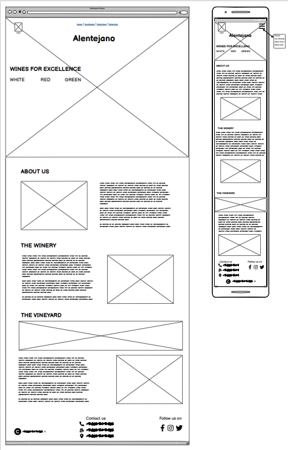

2. Our brands Page

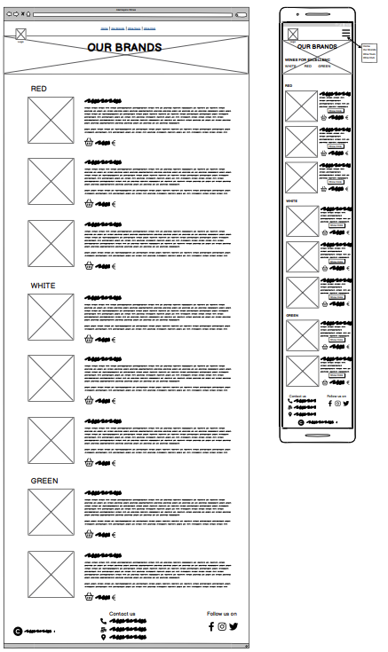

3. Wine tours Page

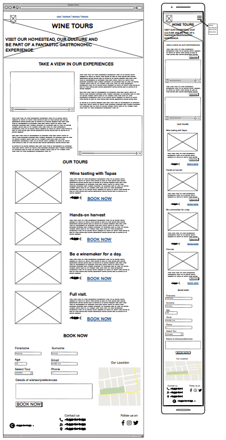

4. Wine club Page

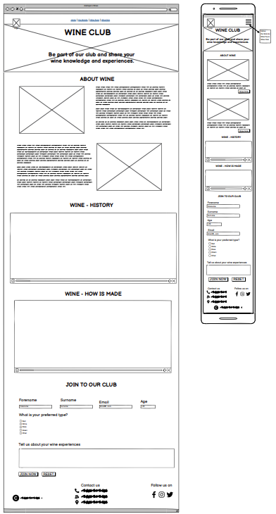

---

## Features

- The ALENTEJANO WINES website project was designed to responsive respond to different screen sizes down to 280px wide .

1. **Navigation Bar**

- Featured on all four pages, fixed on top of the screen overlying the content as it moves up and down.
- This section will allow the user to easily navigate from page to page across all devices without having to revert back to the previous page via the ‘back’ button.
- At left top corner of the navigation bar, the logo image will allow the user to link to home page from all others pages.

- The navigation bar links will responsively responded by a burger button.

2. **Pages front section**

- At each page the front section includes a photograph with text overlay to allow the user to see exactly which location this site would be applicable to.
- The Home front section introduces to the user an eye catching animation to grab their attention.

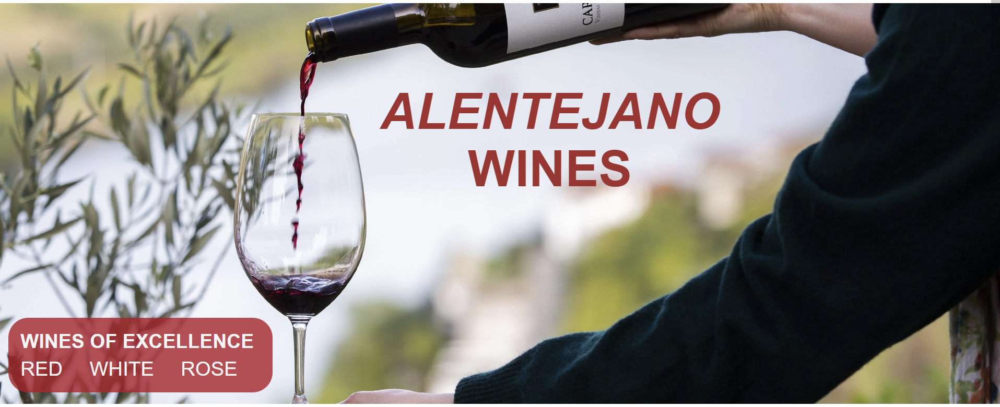

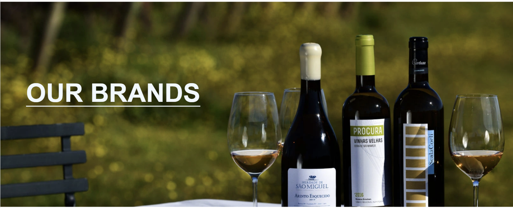

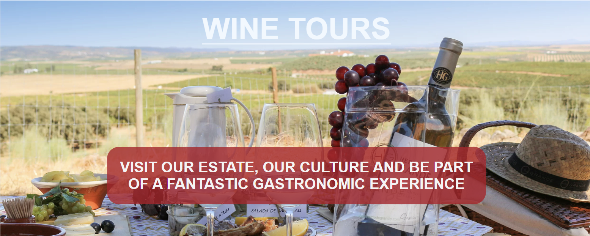

3. **Home page content**

- The content of the home page will present to the user a brief description of the wines, typical wineries and typical vineyards of Alentejo region.

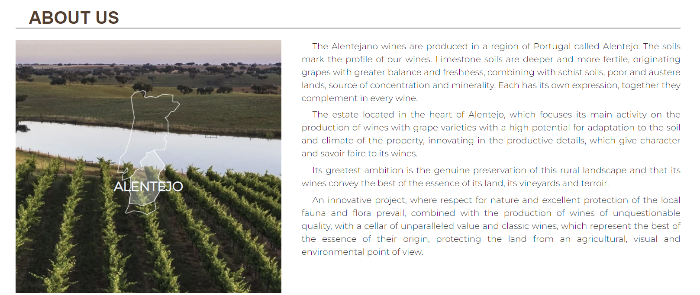

4. **Footer**

- The footer section will present to the user links to social media sites and contact details. The links will open to a new tab to allow easy navigation for the user.

5. **Our Brands page**

- The page of our brands will present a selection of different types and brands of Alentejo wines, presenting a detailed description of each wine and costs.

6. **Wine tours page**

- The first section of the Wine tours page will provide the user with brief information and promotional videos of previous tour experiences.

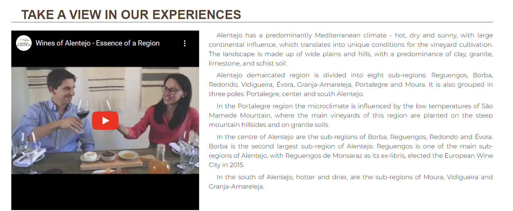

- The second section of the Wine tours page will allow the user to see all available tours and go into detail on each activity.

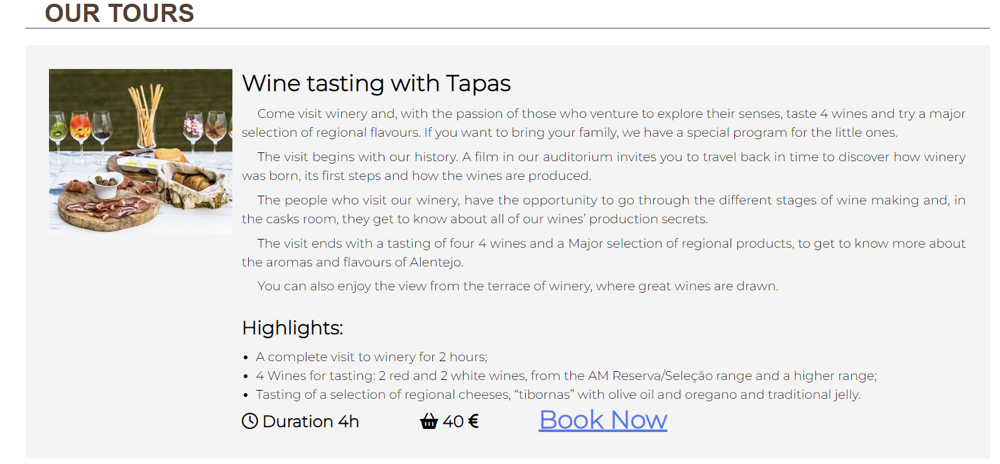

- The third section of the Wine tours page will present a form section that allows the user to fill in and book the desire tour. Also a map is provided to allow the user to see the tours location.

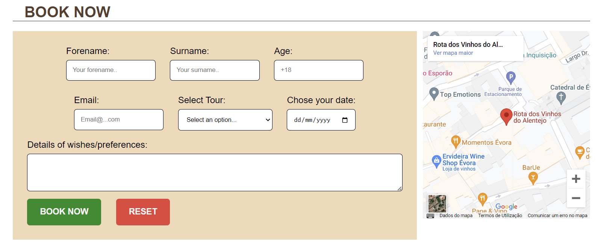

7. **Wine club page**

- In the first section of the Wine club page a brief description of the Alentejo region and wine making techniques will be presented to the user.

- In the second section of the Wine club page will allow the user to see a set of informative videos about wines.

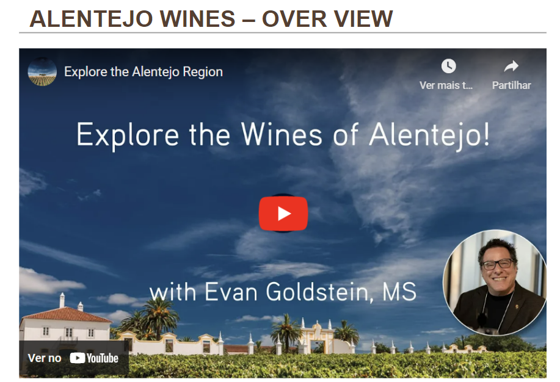

- The third section of the Wine club page will present a form section that allows the user to fill in and join to the wine club.

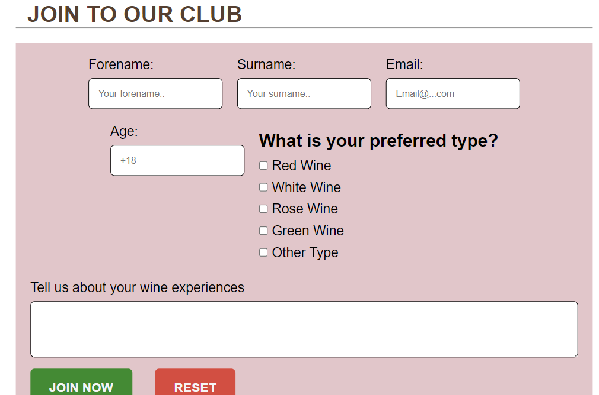

## Technologies Used
---

In this project the following technologies have been used.

### Languages Used

-   [HTML5](https://en.wikipedia.org/wiki/HTML5)
-   [CSS3](https://en.wikipedia.org/wiki/Cascading_Style_Sheets)

### Frameworks, Libraries & Programs Used

- [Google Fonts:](https://fonts.google.com/)
    - Google fonts were used to import the 'Patua+One' font for page titles, 'Hebbo' font for sections titles and 'montserrat' font  for text in general into the style.css file which is used on all pages throughout the project.

- [Font Awesome:](https://fontawesome.com/)
    - Font Awesome was used on all pages throughout the website to add icons for aesthetic, social links and burger button.

- [Hover.css:](https://ianlunn.github.io/Hover/)
    - Hover.css was used on the navigation links and forms buttons to add the float transition while being hovered over.

- [Git](https://git-scm.com/)
    - Git was used for version control by utilizing the Gitpod terminal to commit to Git and Push to GitHub.

- [GitHub:](https://github.com/)
    - GitHub is used to store the projects code after being pushed from Git.

- [Balsamiq:](https://balsamiq.com/)
    - Balsamiq was used to create the wireframes during the design process.

## Testing
---

Along the development of the project regular testing were carried out. And the pages were reloaded several times after each addition and modification.

1. This website is responsive to all screens sizes down to 280px wide and was tested by using the devtools device toolbar.

2. The navigation bar links (burger button in responsive response for small screens), logo link, all read more and less buttons (in responsive response for small screens), imported youtube videos and social media links were tested and all work well.

3. Both forms on the site were tested and the submit button works fine when all required information is filled in correctly.

### Validator Testing

4. The website code was both tested, manually and automatically (using the URL link), through W3C Markup Validator and W3C CSS Validator Services, which were used to validate every page of the project to ensure there were no syntax errors in the project.

- HTML
    - No errors were returned when passing through the official [W3C validator](https://validator.w3.org/) - [Results](https://validator.w3.org/nu/?doc=https%3A%2F%2Fandrefarinha86.github.io%2FAlentejano-Wines%2F)

- CSS
    - No errors were found when passing through the official [(Jigsaw) validator](https://jigsaw.w3.org/css-validator/#validate_by_input) - [Results](https://jigsaw.w3.org/css-validator/validator?uri=https%3A%2F%2Fandrefarinha86.github.io%2FAlentejano-Wines%2F&profile=css3svg&usermedium=all&warning=1&vextwarning=&lang=en)

5. Accessibility 
 - The chosen colors and fonts were confirmed that are easy and accessible by running it through lighthouse in devtools.
    - Home Page

    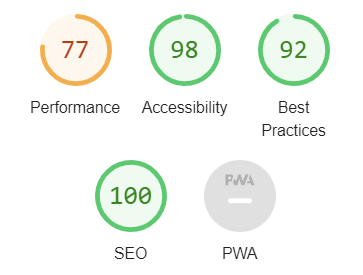

    - Our Brands Page

    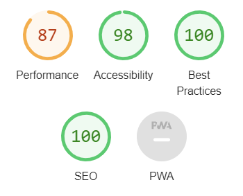

    - Wine Tours Page

    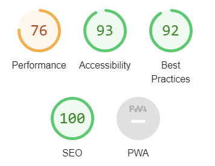

    - Wine Club Page
    
    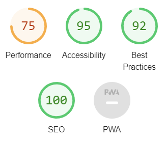

 

### Unfixed Bugs

No unfixed bugs were found.

## Deployment
---

- The site was deployed to GitHub pages. The steps to deploy are as follows:
    - In the GitHub repository [here](https://github.com/AndreFarinha86/Alentejano-Wines), navigate to the Settings tab;
    - From the source section drop-down menu, select the Master Branch;
    - Once the master branch has been selected, the page will be automatically refreshed with a detailed ribbon display to indicate the successful deployment.

The live link can be found [here](https://andrefarinha86.github.io/Alentejano-Wines/)

## Credits
---

### Code

All code was cretead by the developer, guided and inspired by the [Love Running Project](https://github.com/Code-Institute-Solutions/love-running-2.0-sourcecode) from code Institute, [w3schools]https://www.w3schools.com/ and online videos.

### Content and Media

All content and photos were used from the following sources:

- [Herdade do Gamito](http://herdadedogamito.com/Home/tabid/1173/language/en-US/Default.aspx)
- [Adega Mayor](https://www.adegamayor.pt/pt/pt/enoturismo-alentejo/visita-mayores/)
- [Wines of Alentejo](https://www.vinhosdoalentejo.pt/en/)
- [Portugal by wine](https://www.portugalbywine.com/)
- [Wine tourism Portugal](https://www.winetourismportugal.com/en/)

### Acknowledgements

- To my mentors, [Caleb Mbakwe](https://github.com/caleboau2012) [Jack Wachira](https://github.com/iamjackwachira), for support  me along the project,  provide the required assistance and guide me in the right direction.
- The Slack community. All the help, support and information available from other students is really a great tool.

## Other General Project Advice

